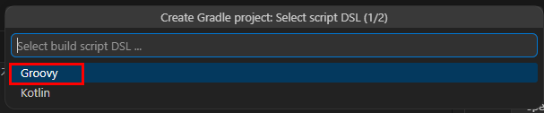
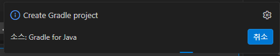
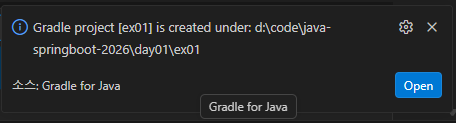
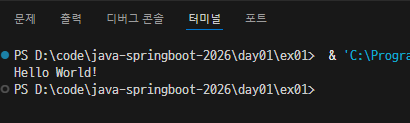

# java-springboot-2026

2026년 java 개발자과정 SpringBoddt 리포지토리

## 1일차

### 개발환경 설정

#### Java 설정

- 터미널/파워셀에서 자바 설치여부 확인

```powershell
> java --version
openjdk 21.0.10 2026-01-20 LTS
OpenJDK Runtime Environment Microsoft-13106404 (build 21.0.10+7-LTS)
OpenJDK 64-Bit Server VM Microsoft-13106404 (build 21.0.10+7-LTS, mixed mode, sharing)
```

- Java 설치되어 있으면 위와 같이 출력
- 아닌 경우는
  - Oracle JDK - https://www.oracle.com/kr/java/technologies/downloads/
  - `OpenJDK` - https://openjdk.org/
  - Adoptium JDK - https://adoptium.net/
  - Azul JDK - https://azul.com/downloads/#zulu

#### VS Code 설정

- 개발툴에 JDK 설정 다양
  - Eclipse, InteliJ, NetBeans, `Visual Stydio Code` 중 선정

- VS Code 확장
  - Java 검색

  
  - 설치. Devugger 포함 6개 확장이 추가 설치됨

#### Java 개발환경 확인

1. 명령 팔레트(Ctrl + Shift + P) 오픈

   

2. `Java: Create Java Projec...` 선택

   

3. 폴더 선택

4. DSL 선택

   

5. Gradle 프로젝트명 선택

   

6. 오른쪽 하단에 프로젝트 진행 팝업

   

7. 완료 메시지 팝업 - 오픈

   

8. 새 VS Code 오픈 - 빌드 진행

   

9. Gradle 확장이 있는지 확인

   

10. app/src/main/java/ex01/App.java 파일 확인

    

11. Ctrl + F5 실행

    

### Java 기본 학습

#### 학습방향

- Python, Javascript 학습완료 상태
  - 변수, 데이터형
  - 연산자
  - 제어문 : 조건문, 반복문
  - 메서드(함수와 동일)
  - 배열/리스트
  - 참조개념
  - 파일 입출력
  - 객체지향
  - 예외처리

- 새로 공부한다 보다는 필요한 것만 보충해서 학습하곘다 생각.

- JavaScript

### Java 기본 문법

#### 코드 구조

- 전체 코드

```java
package ex02_syntax; /* 패키지 선언 */

public class App {  // 클래스 선언
    // 진입점()
    public static void main(String[] args) {
        Sys "Hello World!";
    }

    public static void main(String[] args) {
        System.out.println(new App().getGreeting());
```

## 2일차
