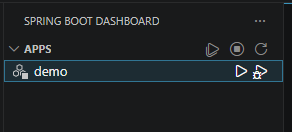
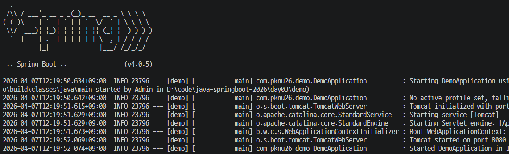
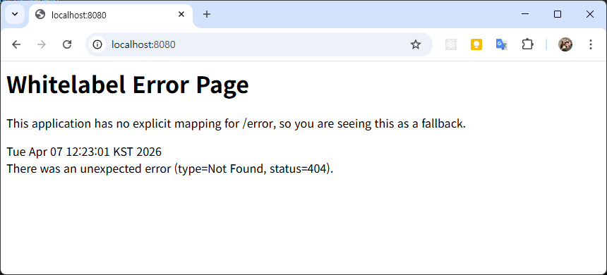
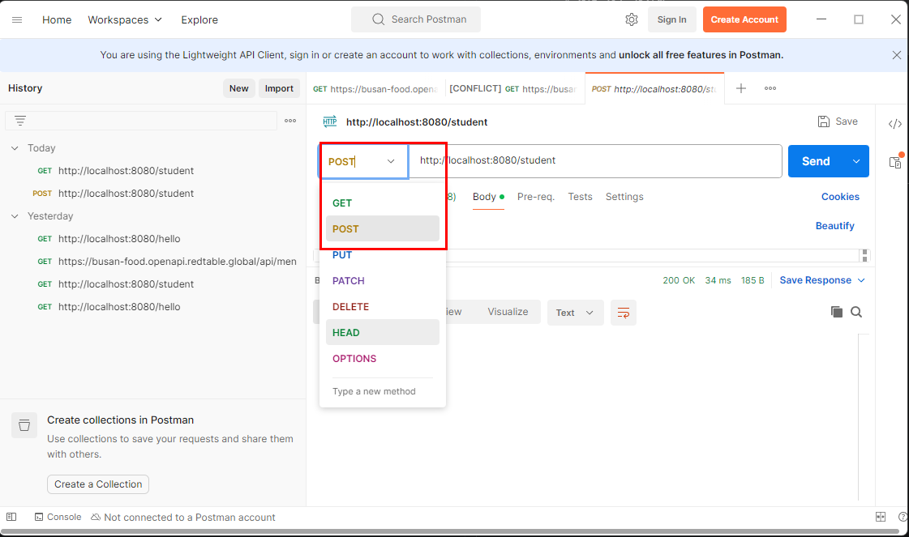
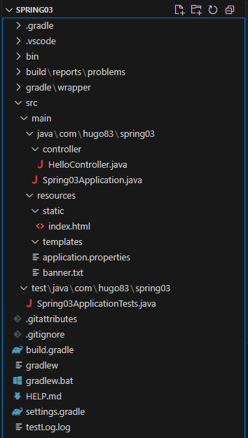
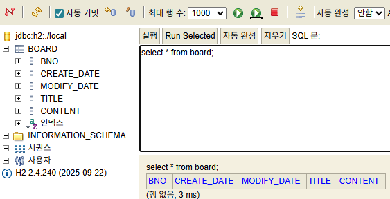
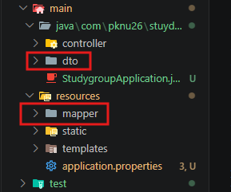
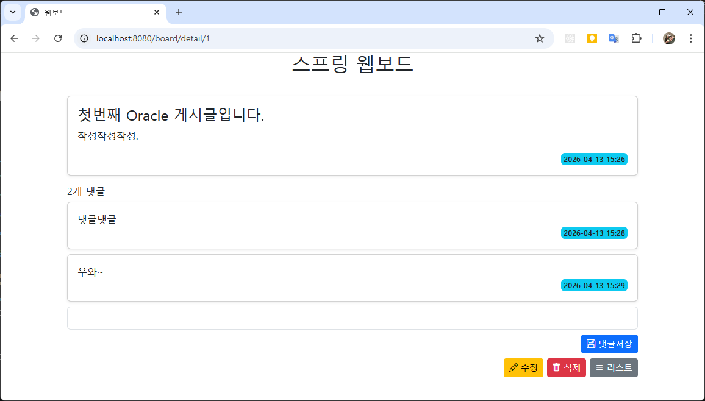

# java-springboot-2026

- 스프링부트 학습내용

## 3일차

### 웹 개요

- 구성 3단계
  - 웹브라우저(프론트엔드) - 사용자의 `요청`하고 결과를 돌려받는 화면. HTML/CSS/JS
  - 웹서버(백엔드) - 사용자 요청을 받아서 DB에 데이터 읽고, 프론트엔드에 보낼 데이터를 전송(`응답`)
  - 데이터베이스 - 데이터를 저장, 읽는 부분

- 웹 개념 : 사용자의 요청(`Request`)에 대한 서버의 응답(`Response`)

### Spring Boot

- Java를 기반으로 웹 서버를 만들 수 있는 백엔드 프레임워크 중 하나

- 웹 기술 히스토리
  - CGI : 내용 생략
  - Servlet : CGI를 개선한 웹 기술. HTML을 Java소스 내 전부 작성(개발 난이도 상)
  - EJB(Enterprise Java Bean) : Servlet으로 대형 기업 프로젝트 개발(개발 난이도 극상)
  - `JSP`(Java Server Page) : HTML과 Java소스를 분리. 쉽게 개발하도록 만든 기술(난이도 중)
    - 개발환경 구성 난이도가 높음
  - `Spring` : Java개발 전성기. 웹페이지와 Java영역 분리. 개발환경 구성 난이도 줄어듬
    - 개발환경 구성 난이도 중
    - 대한민국 전자정부 웹프레임워크 개발
  - `Spring Boot` : Spring 개발환경 구성 단점, 개발 단점 최소화

#### Spring Boot

- https://spring.io/ 공식 웹사이트
- Spring 의 기술 그대로 사용 (마이그레이션 간단)
- JPA 기술 사용, ERD나 DB설계 하지 않고, 손쉽게 DB 생성. 연동 쉬움.
- 개발시 웹 서버를 따로 구축할 필요 없음. (운영 시에는 설치 필요)
- 단위 테스트용 의존성, 로그 의존성 포함
- 개발을 도와주는 서포트 기능 다수 존재
- 프론트엔드 지원 다양. JSP, Thymeleaf, Mustache 등
- React.js 등 자바스크립트 기반 프론트엔드와 연계 -> 풀스택
- MVC(Model-View-Controller) 모델. 각 파트별 따로 개발 가능


#### Spring Boot 개발환경 설정

##### Java

- Java JDK : 17버전 이상
- 시스템 정보에서 JAVA_HOME 등록
- Path 연계

##### 개발툴

- Visual Studio Code 확장
  - Spring Boot Extension Pack 설치
  - Spring Initializr Java Support 설치 확인
  - Lombok Annotations Support for VS Code 설치

##### 데이터베이스

- Database : Oracle 21, H2(Spring Boot 제공)

#### Sprin Boot 프로젝트 생성

1. 명령 팔레트(Ctrl + Shift + P) 에서 `Spring` 검색

   

2. Spring Initializr: Specify Spring Boot version
   - SNAPSHOT : 개발 중 버전. 매우 불안정
   - M2, M3, M4 : 주요기능 완성 단계. 안정버전 아님
   - RC : 출시 직전
   - `4.0.5` : 정식버전

3. Specify project language
   - `java`
   - Kotlin
   - Groovy

4. Input Group Id
   - 그룹 아이디
   - com.example : mail.naver.com / news.naver.com 등 naver.com을 거꾸로 사용하는 것
   - mail, news : 프로젝트 ID // 우리는 그룹아이디 통일하자.
   - `com.pknu26` 로 통일

5. Input Artifact Id
   - 프로젝트 아이디 `demo` 기본

6. Input Package Name
   - 프로젝트아이디. 그룹아이디

7. Specify packaging type
   - Spring 실행파일을 어떤 타입(`Jar`, War)으로 압축할지 지정
   - `Jar` : Java Archive
   - War : Web Archive

8. Specify Java version
   - `21` 버전 선택(호환성)
   - 설치된 JDK 자바버전과 동일 (자바버전이 21이므로 21이하로 사용해야 함)

9. Choose dependencies - [소스](./day03/demo/build.gradle)
   - 필요한 의존성(라이브러리) 선택
   - 최초 Spring Web만 선택

10. Generate into this folder 창에서 폴더

11. 새 창 열기

12. Gradle, Java 빌드 진행
    - 빌드 이후 작업표시줄 `Java: Ready`가 표시되야 함
    - Java: Error는 프로젝트 생성 실패. 새로 구성

    

#### Spring Boot 프로젝트 실행

1. Spring Boot Dashboard

   

2. 컴파일 진행

3. 로그 출력

   
   - Started DemoApplication... port 8000 확인

4. 웹 브라우저 http://localhost:8080

   

5. application.properties 오픈 - [소스](./day03/demo/src/main/resources/application.properties)
   `spring.output.ansi.enabled=always` 작성

#### Spring Boot 필요 설정 확인

- build.gradle : 자바버전, 플러그인, 의존성 설정 파일 - [소스](./day03/demo/build.gradle)

```groovy
 // Gradle 플러그인 설정
 plugins {
     id 'java'   // Java 프로젝트 기본 플러그인
     id 'org.springframework.boot' version '4.0.5'  // Spring Boot 플러그인
     id 'io.spring.dependency-management' version '1.1.7'  // 의존성 버전 자동관리 플러그인
 }

 group = 'com.pknu26'   // 그룹 ID. URL도메인 반대로 작성
 version = '0.0.1-SNAPSHOT'  // 프로젝트 버전. 실제 배포시는 1.0.0 으로 변경

 java {
     toolchain {
         languageVersion = JavaLanguageVersion.of(21)  // 사용 중인 Java JDK 버전
     }
 }

 repositories {  // 의존성 저장소 설정
     mavenCentral()
 }

 // 라이브러리 의존성 설정. 대부분 여기를 설정
 dependencies {
     implementation 'org.springframework.boot:spring-boot-starter-webmvc'  // Spring MVC 구현용
     testImplementation 'org.springframework.boot:spring-boot-starter-webmvc-test'  // 테스트 구현용
     testRuntimeOnly 'org.junit.platform:junit-platform-launcher'  // 단위 테스트 실행기
 }

 // 테스트 작업 설정
 tasks.named('test') {
     useJUnitPlatform() // JUnit5 사용
 }
```

- dependencies 외에는 거의 손댈일 없음

- DemoApplication.java - [소스](./day03/demo/src/main/java/com/pknu26/demo/DemoApplication.java)
  - @SpringBootApplication : 스프링부트 설정 클래스임 지칭. 컴포넌트 스캔 수행. 자동설정 어노테이션
  - SpringApplication.run(...) : 스프링 컨테이너 실행, 내장 서버(톰캣) 띄움

- Spring Boot 실행 명령어

  ```bash
  > .\gradlew.bat bootrun
  ```

#### Spring MVC

- Spring Boot 프로젝트 초기화 동일
  - 의존성에서 Spring Web, Thymeleaf 선택

- Spring MVC 구조

  ```text
  src
  ┣ main
  ┃ ┣ java
  ┃ ┃ ┗ com/pknu26/springmvc
  ┃ ┃    ┣ SpringmvcApplication.java   // 전체 애플리케이션(서버실행)
  ┃ ┃    ┣ controller    // Controller 영역
  ┃ ┃    ┃  ┗ HomeController.java
  ┃ ┃    ┗ service  // Model을 동작시키는 영역
  ┃ ┃       ┗ MessageService.java
  ┃ ┗ resources
  ┃    ┣ templates  // View 영역
  ┃    ┃  ┣ home.html
  ┃    ┃  ┗ hello.html
  ┃    ┗ application.properties
  ```

  - 브라우저 요청 -> Controller 호출 -> Model을 데이터 담고(Service) -> View 반환 -> 요청한 브라우저에 돌려줌

- Spring MVC 구현
  1. Service/MessageService.java 생성 - [소스](./day03/springmvc/src/main/java/com/pknu26/springmvc/Service/MessageService.java)
  2. Controller/HomeController.java 생성 - [소스](./day03/springmvc/src/main/java/com/pknu26/springmvc/Controller/HomeController.java)
  - 필요한 그룹에 따라 여러개 컨트롤러를 만들 수 있음
  3. View, src/main/resources/templates/home.html 생성 - [소스](./day03/springmvc/src/main/resources/templates/home.html)
  4. 기본 순서는 Controller, Service와 View 순
  5. 소스코드 작성, 수정 이후 서버 재시작 필수!

- 어노테이션 목록
  - @SpringBootApplication : 손대지 말것
  - @Controller : 컨트롤러 영역
  - @Service : 모델처리를 위한 서비스 영역
  - @GetMapping, @PostMaping : 웹 매핑 종류 결정
  - @ResponseBody : 응답페이지에 텍스트 출력 어노테이션, 자바의 String 문자열 웹페이지 렌더링 작업

- Model, View, Controller 영역
  - 구분지어서 따로 개발
  - 팀 프로젝트 가능. 역할분담

#### Spring Log

- 로그 출력 작업
  - application.properties 에 로그 설정 - [소스](./day03/springlog/src/main/resources/application.properties)

  ```
  ## 스프링부트 내장 로그모듈 사용
  logging.level.root = info
  # 로그 저장 파일 지정
  logging.file.name = /testlog.log
  ```

- 로그 사용법 - [소스](./day03/springlog/src/main/java/com/pknu26/springlog/HomeController.java)
  - Controller, Service, Respository 클래스에서 사용가능

#### Spring Log 배너

- 중요도 없음

- resources 폴더에 banner.txt 생성 - [소스](./day03/springlog/src/main/resources/banner.txt)
- [Spring Boot Banner Generator](https://devops.datenkollektiv.de/banner.txt/index.html)


## 4일차

### Spring Boot 계속

### Spring Boot Frontend

- 예제 : [소스](./day04/httpmethod/src/main/resources/templates/create.html)

- 방법
  - jsp 페이지 : 가장 구식 방식. 예전 Spring이전 JSP 개발 방식을 접목
  - 예. https://innobiz.or.kr/IB/business/business.asp
    https://www.gabia.com/gabia_notice/view.php?seq_no=17781
  - `thymleaf` 페이지 : html로 사용. 템플릿 방식. jsp 페이지 처럼 URL을 공개하지 않는 방식 사용
- mustache 페이지 : .mustache 확장자 사용. 템플릿 방식
- react.js 페이지 : JS 방식으로 전환

#### 어노테이션

- 예제 : [소스](./day04/httpmethod/src/main/java/com/pknu26/httpmethod/controller/StudentController.java)

#### @SpringBootApplication

- 스프링부트 자동 구성 매커니즘 활성화
- 어플리케이션 내 패키지에서 필요 컴포넌트 스캔
- 톰캣 서버 실행, 웹 사이트 초기화
- 설정 클래서(컨트롤러, 서비스, 리포지토리, 뷰..) 임포트 활성화, 스프링부트 실행
- 손대지 말 것!

##### @Controller

- 컨트롤러 컴포넌트를 구체화 해당클래스 IoC컨테이너에 Bean(관리되는 클래스) 등록
- JSP/HTML 같은 화면과 연계되는 방식

##### @ResController

- RestFull API 개발시 사용하는 컨트롤러
- 화면X, JSON/XML 데이터만 반환
- React.js 같은 외부 프론트엔드와 연결해서 풀스택 개발시 사용

##### @Service

- 비지니스 로직을 처리하는 클래스
- 모델, 리포지토리 연결해주는 중간 인터페이스 역할

#### HTTP 메서드 포함 이노테이션

- 웹사이트 모두 HTTP 프로토콜 내에서 동작
- GET, POST, PUT, DELETE 확인
- 브라우저나 앱에서 서버에게 요청할 때 사용하는 패턴

##### @GetMapping

- GET HTTP 메서드 처리 이노테이션
- `@GetMapping("/students")`
- 웹서버의 데이터를 조회할 떄 사용
  - 게시글 목록보기
  - 회원정보 조회
  - 상품 상세 보기

- 데이터를 보여주는 역할

##### @PostMapping

- POST 메서드 처리 어노테이션
- `@PostMapping` // - 다시 여기서부터 깃허브 확인
- 폼에서 데이터를 받아 생성역할. 백엔드 작업
- 버튼 클릭으로 submit이 발생하면 실행

##### PutMapping

- PUT 메서드 처리 어노테이션
- `@PutMapping`
- RestController에서는 자주 사용, Controller에서는 거의 안씀
- 데이터 수정을 위한 Mapping
- PostMapping 으로 전부 대체 가능

##### @DeleteMapping

- DELETE 메서드 처리 어노테이션
- `@DeleteMapping`
- 거의 사용되지 않
- 데이터 삭제시 사용하는 Mapping
- Post로 가능.

##### @RequestMapping

- GET, POST를 모두 지원하는 매핑
- `@RequestMapping` : Get, POST, PUT 다 사용할 수 있는 매핑
- 각각의 메서드별 매핑이 존재해서 현재는 많이 사용안됨
- 전체 컨트롤러의 동일한 URL 페이지명 통합할 때 자주 사용
- 사용법

```java
@RequestMapping(value = "/create", method=RequestMethod.GET) // RequestMeshod.POST 도 사용 가능
```

##### @RequestParam

- GET으로 요청되는 URL에 포함된 파라미터값 읽기 어노테이션
- 검색, 필터에서 많이 사용
- URL뒤에 ? 뒤쪽에 위치, 각 값은 key=value 구분자는 &
- URL http://localhost:8080/search?name=kim&age=23
- 메서드 파라미터 사용

  ```java
  public String search(@RequestParam String name, @RequestParam int age, Model model) {}
  ```

  ##### @PathVariable
  - 상세 조회 사용
  - 현세대 웹개발 URL 사용시 사용되는 형태
  - 메서드 파라미터 사용

  ```java
  @GetMapping("/{id}")
  public String getStudent(@PathVariable int id, Model model) {
  ```

##### @ModelAttribute

- 자동바인딩, 모델 전달 시 사용
- form 태그에서 객체 바인딩, model에도 자동 추가
- 메서트 파라미터 사용

  ```java
  @PostMapping("/create")
  public String create(@ModelAttribute("student") Student student, Model model) {
  ```

  #### Thymeleaf
  - 개요
    - Spring Boot에서 HTML 화면을 만들 떄 활용하는 템플릿 엔진
    - HTML 안에 Spring에서 생성한 데이터를 꽂아 넣는 도구

    ```java
    model.addAttribute("name", "유고");
    ```

    ```html
    <p th:text="${name}"></p>
    ```

  - 순서
    1. Java(Spring Boot)에서 데이터 준비
    2. Thymeleaf로 HTML에 데이터 렌더링 지정
    3. 브라우저에서 완성된 화면 표시

##### 의존성 구성

- build.gradle, dependencies에 아래 코드 추가 - [소스](./day04/httpmethod/build.gradle)

  ```groovy
  implementation 'org.springframework.boot:spring-boot-starter-thymeleaf'
  ```

##### 기본 위치

- src/main/resources/templates 폴더 내에 위치 - [폴더](./day04/httpmethod/src/main/resources/templates/)

##### 컨트롤러 호출

- return문으로 처리

  ```java
  return "/board/list";    // templates 밑 board 폴더 아래의 list.html 호출
  ```

##### 기본문법

- Thymeleaf 초기설정 : 안써도 동작하지만, 쓰는 걸 습관화 할 것

  ```html
  <html xmlns:th="http://www.thymeleaf.org"></html>
  ```

- 아래의 키워드를 HTML 상에 적절하게 배치하면 됨
  - `th:text="${필드명}"` : 값 출력
  - `th:text="${객체명.필드명}"` : 객체 내 각 필드값 출력
  - `th:each="객체명 : ${리스트명}"` : 반복문
  - `th:if=${변수명 >= 20}"` : 제어문 IF문. 반대로 `th:unless`도 존재
  - `th:href="@{/students/list}"` : a 태그의 링크와 동일
  - `th:value=${객체명.필드명}` : 수정 폼에서 사용
  - `th:object="${객체명}" + th:field="*{필드명}"` : Spring 폼 바인딩 정석

#### Spring Boot RestAPI

- RestController 개념
  - HTML이 아니라 JSON데이터를 반환하는 방식

  | 구분 | @Controller   | @RestController  |
  | ---- | ------------- | ---------------- |
  | 용도 | 웹페이지      | API 서버         |
  | 특징 | template 필요 | 바로 데이터 반환 |

- RestAPI 예제 - [소스](./day04/restapi/src/main/java/com/pknu26/restapi/controller/StudentController.java)

#### Spring Boot 서버 Tip

- 웹서버 자동 빌드
  - 명령 팔레트
    - 설정 (Ctrl + ,)
      - Java > Autobuild: Enabled 확인

    - application

  ```
  # 서버 자동 재시작
  spring.devtools.restart.enabled=true
  spring.devtools.livereload.enabled=true
  ```

#### POSTMan 설치

- RestAPI, OpenAPI 테스트툴
- https://www.postman.com/downloads/

## 5일차

### build.gradle 관련 팁

- Gradle(자동설치) 사용시 관련 파일 위치 : C:\Users\Admin\.gradle
- build.grdle 의존성(라이브러리)가 다운로드 후 .gradle 폴더하위에 설치

### Spring Boot RestAPI

#### HTTP 메서드 정리

- GET : 웹브라우저 주소창에 URL로 전달하는 것
- POST, PUT, DELETE : 뒷단(백그라운드)에서 데이터를 전달하는 것 //입력하고 버튼누르는건 포스트 // 뉴스클릭해서 뜨는 창 등 그런건 전부 겟

#### POSTMan 사용법

- 설치 후 실행할 때 회원가입이나 로그인 필요없음(Continue without an account)

  

- HTTP 메서드 종류 변경해서 테스트
- POST, PUT, DELETE 의 경우는 Body 클릭, raw, json 선택 후 필요데이터(json) 입력 후 Send 버튼 클릭

### Spring Boot JPA + DB연동

#### Spring Boot 프로젝트 구조



- .gradle : 빌드도구 Gradle에 필요 구성 폴더. 현재 9.4.1
- .vscode : VS Code가 프로젝트에 필요한 설정 담는 폴더
- bin : 자바 컴파일 후 생성되는 class 파일 위치
- gradle : gradle을 자바에서 쓸수있게 만든 라이브러리 위치
- `src/main/java`(src='소스'라고 부름) : 패키지와 자바 소스가 저장된 폴더
  - com/pknu26/httpmethod : 지정한 Group ID와 Artifact ID를 합성한 폴더(com.pknu.httpmethod)
  - HelloController 클래스 접근 : com.hugo83.spring03.controller.HelloController 로 접근 // (이렇게 사용한다는 얘기)
- `Spring03Application.java` : Spring Initializr가 생성하는 기본 클래스. 시작 메서드 존재
- `src/main/resources` : 자바이외 HTML, CSS, JS, 이미지 파일, 환경파일 등 리소스가 되는 파일 저장하는 폴더
  - static : 정적파일, CSS, JS, 이미지 파일 저장
  - templates : 스프링부트와 연계되는 Thymeleaf html이나 mustache 파일 저장 -` application.properties` : 프로젝트 환경설정, DB설정, 환경변수
- src/test/java : JUnit 테스트 도구 자바파일 저장
- .gitattributes : 깃서버에서 어떻게 처리할지 결정
- .gitignore : 깃서버에 올릴 때 제외시킬 폴더, 파일
- `build.gradle` : Gradle 기초 설정 파일. 필요 의존성(라이브러리) 등 설정
- gradlew : 리눅스, 맥에서 사용하는 실행파일
- gradlew.bat : 윈도우에서 사용하는 실행파일 // 손 댈 상황 거의 없을 것. 참고.
- HELP.md : 도움말 마크다운
- settings.gradle : rootProject.name 설정. 고급 Gradle 설정.

##### Spring Boot webboard

1. 프로젝트 생성

- Spring Initializr 이전 내용 동일
- Choose dependencies 선택할 의존성 - [소스](./day05/webboard/build.gradle)
  - Spring Boot DevTools : 개발할 때 필요한 툴 기능 포함
  - Lombok : Getter/Setter 자동 만들어주는 라이브러리
  - Spring Web : 웹사이트 관련 작업
  - Thymeleaf : HTML 템플릿 엔진
  - Spring Data JPA : DB와 ORM연동 라이브러리
  - H2 Database : 개발동안 사용하는 파일 DB
  - Oracle Driver : 실제 운영할 DB

2. H2 DB 설정

- application.properties DB설정 추가 - [소스](./day05/webboard/src/main/resources/application.properties)

```properties
## H2 DB Setting
spring.h2.console.enabled=true
# 콘솔 URL
spring.h2.console.path=/h2-console
# H2 DB 파일 위치
spring.datasource.url=jdbc:h2:./local
# H2 DB 접속용 드라이버
spring.datasource.driver-class-name=org.h2.Driver
# H2 DB 접속계정
spring.datasource.username=sa
spring.datasource.password=12345
```

3. JPA

- Java Persistence API : 자바 관계형 데이터베이스 핸들링 방식 ORM 기술 사용라이브러리
- ORM : 쿼리를 실행하지 않고 DB와 Java 간에 데이터 자동 매핑하는 기술

- application.properties JPA 설정 추가 - [소스](./day05/webboard/src/main/resources/application.properties)

```properties
## JPA DB Settings
spring.jpa.properties.hibernate.dialect=org.hibernate.dialect.H2Dialect
# create 또는 update
spring.jpa.hibernate.ddl-auto=update
# 로그 쿼리 출력
spring.jpa.properties.hibernate.format_sql=true
spring.jpa.properties.hibernate.show_sql=true
```

4. controller, entity, repository, serivce 폴더(패키지) 생성 - [폴더](./day05/webboard/src/main/java/com/pknu26/webboard/)

5. controller/HomeController.java 작성 - [소스](./day05/webboard/src/main/java/com/pknu26/webboard/controller/HomeController.java)

6. reources/templates/home.html 작성 - [소스](./day05/webboard/src/main/resources/templates/home.html)

7. entity/Board.java 작성 - [소스](./day05/webboard/src/main/java/com/pknu26/webboard/entity/Board.java)

- 어노테이션
  - JPA 어노테이션
  - Lombok 어노테이션

8. 웹서버 실행 후 /h2-console 확인



9. 테스트는 웹서버 중지상태에서 실행할 것 - [소스](./day05/webboard/src/test/java/com/pknu26/webboard/WebboardApplicationTests.java)

## 6일차

### Java 문법 추가

- Record
  - 데이터만 간단하고 안전하게 표현하기위한 특이한 클래스 타입
  - 데이터를 담은 객체를 아주 간결하게 만들것
  - 2020년 Java 14에서 첫 등장, 2021년 Java 16에서 정식 사용

- Record 이전

  ```java
  public class User {
      private final String name;
      private final int age;

      public User(String name, int age) {
          this.name = name;
          this.age = age;
      }

      public String getName() { return name; }
      public int getAge() { return age; }
      // Setter도 필요시 생성

      @Override
      public String toString() { ... }
    ...
  }
  ```

  - 간단한 작업을 위해서 클래스 전체를 다 구현

- Record 사용
  - 데이터를 수정할 순 없음
  - 클래스보다 편하게 데이터 가져올 수 있음

  ```java
  public record User(String name, int age) {}

  User s = new User("이름", 100);
  System.out.println(s.name());
  System.out.println(s.age());
  ```

### Autowired

- @Autowired : Spring Boot 핵심철학 의존성주입(DI)를 자동으로 해주라는 의미
  - 생성자를 직접 구현하면 @Autowired가 필요없음

- @RequiredArgConstructor : 파라미터 생성자를 자동으로 생성해주나, final 또는 @NotNull로 지정된 변수만 포함 생성

### Spring Boot webboard 계속

- Spring Boot JPA 구현순서
  - Controller 생성, HTML > Entity 생성 > Repository 생성 > Service 생성 > Controller 재수정

- Service 영역 필요이유
  - Controller에서는 View로 보낼 데이터만 제대로 처리
  - Service는 실제 비즈니스 로직과 데이터 처리를 담당. 리포지토리와 컨트롤러의 중간다리 역할

#### Board 작업 순서 1

1. BoardController 생성 - [소스](./day06/webboard/src/main/java/com/pknu26/webboard/controller/BoardController.java)
2. board_list.html 생성 - [소스](./day06/webboard/src/main/resources/templates/board_list.html)
3. Board 생성 - [소스](./day06/webboard/src/main/java/com/pknu26/webboard/entity/Board.java)
4. BoardRepository 생성 - [소스](./day06/webboard/src/main/java/com/pknu26/webboard/repository/BoardRepository.java)
5. BoardService 생성 - [소스](./day06/webboard/src/main/java/com/pknu26/webboard/service/BoardService.java)
6. BoardController 수정 - [소스](./day06/webboard/src/main/java/com/pknu26/webboard/controller/BoardController.java)

#### Thymeleaf 레이아웃

- ~~의존성필요 X~~
  - ~~thymeleaf-layout-dialect 의존성 없으면 동작안함~~
  - ~~build.gradle 추가~~
  - Spring 4.x 에서 thymeleaf layout 라이브러리가 제대로 동작안함
  - layout.html - [소스](./day06/webboard/src/main/resources/templates/layout.html)
    - th:fragment="layout(content)"
    - th:replace="${content}"
  - list.html
    - th:replace="~{layout :: layout(~{::content})}"
    - th:fragment="content"

#### Bootstrap 디자인 적용

- 방법 1 : Bootstrap 관련 리소스 다운로드 후 static 폴더 저장
- `방법 2` : CDN으로 링크를 사용. 실행시 캐시에 다운로드받기
  - https://getbootstrap.com/
  - layout.html 리소스 태그 추가 - [소스](./day06/webboard/src/main/resources/templates/layout.html)

  

#### Board 작업 순서 2

1. validation 관련 의존성 추가

- build.gradle - [소스](./day06/webboard/build.gradle)

```groovy
implementation 'org.springframework.boot:spring-boot-starter-validation'
```

2. validation 폴더 생성

3. BoardForm.js 생성 - [소스](./day06/webboard/src/main/java/com/pknu26/webboard/validation/BoardForm.java)
4. board_create.html 생성 - [소스](./day06/webboard/src/main/resources/templates/board_create.html)
5. BoardService.java 추가 - [소스](./day06/webboard/src/main/java/com/pknu26/webboard/service/BoardService.java)
6. BoardController.java 메서드 추가 - [소스](./day06/webboard/src/main/java/com/pknu26/webboard/controller/BoardController.java)

## 7일차

### Spring Boot webboard 계속

#### 추가 어노테이션

- 일반
  - @RequiredArgContructior : final 멤버변수 파라미터를 생성자로 만들어주는 Lombok 어노테이션
  - @AllArgsConstructor : 클래스 모든 멤버변수를 파라미터로 생성자 생성
  - @NoArgsContructor : 기본 생성자를 자동으로 생성

- DB 모델용
  - @OneToMany : DB모델링 1대 다 ERD 관계를 entity내 클래스에서 설정.

#### Board 수정

- 게시글 수정
  - board_create.html을 create와 modify 모드로 분리
  - board_detail.html에 수정 버튼 추가
  - BoardController에 /modify{bno} GetMapping, PostMapping 작업
  - BoardService에 putBoardOne 메서드 작업

- 게시글 삭제
  - board_detail.html을 삭제 버튼 추가
  - BoardController에 /delete/{bno} GetMapping 메서드 추가
  - BoardService에 deleteBoardOne 메서드 작업 // 댓글 수정 학습은 추가로 안할예정.(댓글은 수정 잘 안하니깐~)

#### Reply 작업

- entity/Reply 클래스
  - 이전 Board 클래스 생성시와 동일
  - Board board 멤버변수를 @ManyToOne으로 추가

- entity/Board 클래스
  - `List<Reply>` replyList 멤버변수, @OneToMany로 추가

- repository/ReplyRepositry 인터페이스 생성
- service/ReplyService 클래스 생성, setReply() 메서드 작성
- validation/ReplyForm 클래스 생성
- controller/ReplyController 클래스 생성
- controller/BoardController 클래스 내 showDetail() 메서드 ReplyForm 파라미터 추가
- templatates/board_detail.html 댓글 영역 코드 추가

#### H2 DB에서 Oracle로 전환

- application.properties에 H2관련설정을 Oracle로 변경
- 시퀀스 문제(increase 50) 해결
- Board content 길이 문제 해결
  - Oracle에서는 VARCHAR2(4000) 이상 사용못함. 4000자 이상 불가능
  - 긴 글, 이미지, 영화 등 대용량 데이터를 저장시 LOB(Large OBject) 타입 사용
  - CLOB(Charactor LOB), BLOB(Binary LOB)

  

### MyBatis Spring Boot

- Spring Boot 4.0.5
- JDK 21
- Gradle 9.x
- Oracle 21
- MyBatis
- REST API 테스트
- Spring MVC

#### 프로젝트 생성

- Spring Initiolizr: Create a Gradle Project
- Artifact ID : studygroup
- Choose dependencies
  - Spring Boot DevTools
  - Lombok
  - Spring Web
  - Oracle Driver
  - Thymeleaf
  - SpringDoc OpenAPI - swagger ui
  - MyBatis

#### Oracle 사용자, 스키마 생성

```sql
-- StudyGroup 사용자, 스키마
CREATE USER studygroup IDENTIFIED BY java12345;

-- 권한
GRANT ALL PRIVILEGES TO studygroup;
```

#### 테이블 생성

```sql
-- student 테이블
CREATE TABLE student (
   id NUMBER(10) PRIMARY KEY,
   name VARCHAR2(100) NOT NULL,
   age NUMBER(3),
   major VARCHAR2(100)
);

-- 시퀀스
CREATE SEQUENCE student_seq
START WITH 1
INCREMENT BY 1
nocache;

-- 샘플 데이터
INSERT INTO student VALUES (student_seq.nextval, '홍길동', 20, '컴퓨터공학');
INSERT INTO student VALUES (student_seq.nextval, '이영희', 22, '전자공학');

COMMIT;
```

#### application.properties 설정

- Oracle 설정
- MyBatis

#### MyBatis

- 개발자가 작성한 SQL문을 매핑해서 지원하는 프레임워크
- DB 쿼리를 xml로 Java 코드와 분리, 유지보수와 생산성을 높이는 기능
- JPA : ORM 프레임워크와 달리 직접 쿼리를 작성
- JPA가진 복잡한 쿼리 문제를 MyBatis로 해결
