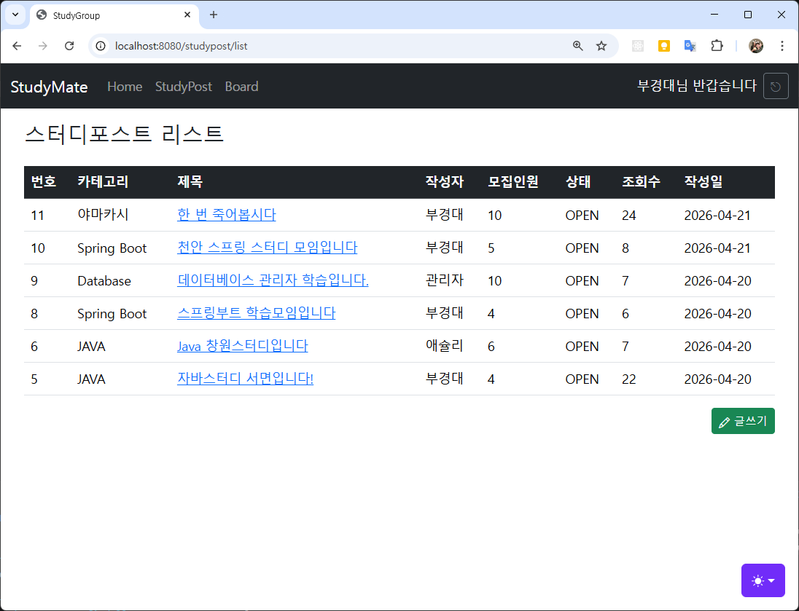

# java-springboot-2026

## 12일차

### ToyProject - StudyGroup

#### 스터디모집 DB설계

- 스터디모집 ERD
  

- 테이블 관계
  - 스터디 종류 카테고리 1개는 여러개의 스터디글에 포함
    - `categories 1 : N study_posts`
  - 사용자 1명은 여러개의 스터디글을 쓸 수 있음
    - `user_account 1 : N study_posts`
  - 사용자 1명은 여러개의 댓글을 쓸 수 있음
    - `user_account 1 : N comments`
  - 스터디 게시글 1개에는 여러 개의 댓글이 적힘
    - `user_posts 1 : N comments`
  - 사용자 1명은 여러 스터디 게시글에 신청가능
    - `user_account 1 : N study_applications`
  - 스터디 게시글 1개에는 여러 신청이 들어옴
    - `study_posts 1 : N study_applications`

#### 스터디모집 웹사이트

```
├─ config : 회원가입, 로그인 시 암호화
├─ controller : MVC 패턴 중 Controller 영역
├─ dto : MVC 패턴 중 Model에 직접연관(DB 테이블 매핑)
├─ mapper : MVC 패턴 중 Model. DB 쿼리 매핑
├─ service : MVC 패턴 중 Model. 비지니스(도메인) 로직
├─ validation : MVC 패턴 중 View. 화면 입력 검증
└─ resiyrces : 웹페이지 리소스
    ├─ mapper : MVC 패턴 중 Model. DB 쿼리 위치
    ├─ static : View에 포함되는 이미지, css, 정적HTML, js 위치
    └─ templates : MVC 패턴 중 View. 실제 화면을 나타낼 영역
```

- 카테고리 CRUD
  - dto, Category 클래스 생성
  - validation, CategoryForm 클래스 생성
  - mapper, CategoryMapper 인터페이스, xml 생성
  - service, CategoryService 클래스 생성
  - controller, Admin용 CategoryController 클래스 생성
  - templates/admin/category/list.html, form.html 생성


- 수정, 삭제 기능 완료

- 스터디포스트 CRUD
  - dto, StudyPost 클래스 생성
  - mapper, StudyPostMapper 인터페이스, xml 생성
  - valiation, StudyPostForm 클래스 생성. dto, StudyPost 멤버변수 복사 사용
  - service, StudyPostService 클래스 생성
  - controller, StudyPostController 클래스 생성
  - templates/post/list.html, form.html 생성

  

  

#### 조회수 증가

- 스터디포스트 상세보기 확인

## 13일차

#### 스터디모집 기능

- 스터디포스트 아래 댓글 기능
  - dto, Comment 클래스
  - validation, CommentForm 클래스
  - mapper, CommentMapper 인터페이스
  - templates/mapper, CommentMapper.xml SQL
  - service, CommentService 클래스
  - controller, CommentController 클래스
  - contoller, StudyPostController.detail() 댓글목록, 폼 추가
  - html, post/dedatil.html 화면 추가

  

- 스터디신청 기능
  - dto, StudyApplication 클래스
  - validation, StudyApplicationForm 클래스
  - mapper, StudyApplicationMapper 인터페이스
  - templates/mapper, StudyApplication.xml
  - service, StudyApplicationService 클래스
  - controller, StudyApplicaitonController 클래스
  - html, post/detail.html 화면 추가

  

#### 필요이슈

- [x] 컨트롤러 post 메서드 파라미터 순서 중요
  - 입력검증 파라미터 다음에 BindingResult 위치해야 함!
  - @Valid CommentForm commenntForm, BidingResult bindingResult, ...

- 스터디 신청 문제 - 신청리스트 띄워서 일단 반정도 완료
  - 중복신청 알림 없음
  - 신청 후 메시지 없음

- home.html 관리자 관리할 화면 생성
- home.html 동적바인딩
- 기존게시판 상세 디자인 StudyPost 상세 형태로 변경
- 로그아웃 후 home으로 이동
- 에러페이지 필요
- [x] Join, Login 페이지 버튼 디자인 변경
- 스터디포스트 페이징
- 전체 푸터 작업
- 파일 업로드
- Spring Security
- JMT
- React와 연동

- 미니프로젝트 팀 구성
- 미니프로젝트 주제 //서비스가 비지니스 로직이다.
